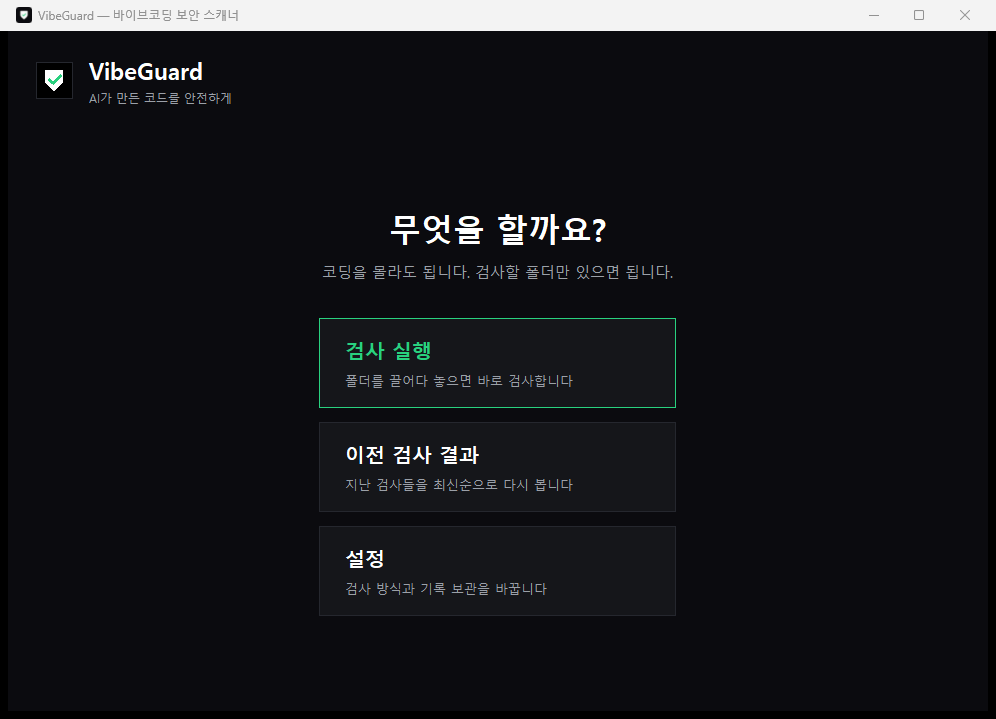

# VibeGuard

A command-line security scanner for code written with AI assistants. It reports suspicious code patterns, package names that may not exist, and known dependency vulnerabilities, with explanations and suggested fixes.

VibeGuard uses the Python standard library and has no runtime package dependencies. Finding descriptions in the application are currently in Korean.



## Features

- Scan for exposed secrets, unsafe execution, injection, insecure web settings, and weak cryptography.
- Check imports and dependencies against PyPI and npm, and flag names similar to popular packages.
- Query [OSV](https://osv.dev) for vulnerabilities and fixed versions, using lockfiles when available.
- Produce terminal, JSON, Markdown, SARIF, and standalone HTML reports.
- Use a desktop app or a local browser interface.
- Configure excluded paths, disabled rules, severity thresholds, and accepted findings.
- Install pre-commit hooks and use scanning in an AI agent's editing workflow.

A score describes the scanned scope; it does not certify the whole application. Scans with no supported files are marked unscanned. Incomplete reads are marked incomplete. Neither receives a score. HTML-only folders are currently unscanned.

## Desktop app

Download the appropriate executable from [Releases](https://github.com/nohseongmin/VibeGuard/releases) and open it. For Windows, use `VibeGuard-windows.exe`. Python is not needed.

Drag a folder into the window or choose one to scan. The app also provides saved scan history and settings for live lookups, minimum severity, excluded folders, and history retention.



Settings and history are stored in the user profile, under `%APPDATA%\VibeGuard` on Windows. Dropping a folder onto the executable opens and scans that folder.

Releases are published after tests, self-scanning, version checks, and builds for three operating systems pass. Compare the download's SHA256 with `SHA256SUMS.txt`. Local build dependencies are pinned in `requirements-build.txt`.

## Installation

```bash
git clone https://github.com/nohseongmin/VibeGuard
cd VibeGuard
pip install -e .
```

From the source directory, scanning also works without installation:

```bash
python -m vibeguard scan .
```

With Docker:

```bash
docker build -t vibeguard .
docker run --rm -v "${PWD}:/scan:ro" vibeguard scan .
```

The target is mounted read-only.

## Commands

```bash
vibeguard scan .
vibeguard scan app.py
vibeguard scan . --format json
vibeguard scan . --format md -o report.md
vibeguard scan . --offline
vibeguard scan . --fail-on high
vibeguard scan . --format sarif -o out.sarif
vibeguard scan . --format html -o report.html
vibeguard scan . --write-baseline .vibeguard.json
vibeguard scan . --baseline .vibeguard.json
vibeguard scan . --diff
vibeguard rules
vibeguard init-hooks
vibeguard app
vibeguard gui
vibeguard gui --port 8080
```

`--offline` skips registry and OSV calls. `--fail-on high` exits with code 1 when high-or-higher findings are present. A baseline hides accepted findings, and `--diff` scans files changed in Git.

The desktop interface uses tkinter. The browser interface uses `http.server`, binds to `127.0.0.1`, and opens at port 8000 by default. `VibeGuard-GUI.bat` on Windows and `VibeGuard-GUI.command` on macOS also launch it.

## Detection scope

| Category | Rules | Examples |
|---|---|---|
| Secrets | VG-SECRET-001–012 | Provider keys, private keys, plain-text passwords, credentials in database URLs |
| Execution | VG-EXEC-001–008 | eval, exec, shell commands, pickle, unsafe YAML loading, zip-slip |
| Injection | VG-SQLI-001–004, VG-SSTI-001 | String-built SQL, MongoDB $where, Flask template injection |
| Web settings | VG-WEB-001–011 | Debug mode, unrestricted CORS, disabled TLS verification, public binding, innerHTML, open redirects |
| Cryptography | VG-CRYPTO-001–006 | MD5/SHA1, non-cryptographic tokens, DES/ECB, disabled JWT verification |
| Go | VG-GO-001–003 | InsecureSkipVerify, formatted shell commands and SQL |
| PHP | VG-PHP-001–003 | eval, variable shell commands, request values in SQL |
| Ruby | VG-RB-001–003 | eval, interpolated shell commands, Marshal deserialization |
| Java | VG-JV-001–003 | Concatenated execution and SQL, MD5/SHA-1 |
| Supply chain | VG-SLOP-001–002 | Missing packages and possible typosquatting |

Supported code files include Python, JavaScript, TypeScript, Go, PHP, Ruby, and Java. Secret rules apply across text files.

Package checks gather imports and dependencies, verify registry entries, and flag edit-distance matches to popular packages. A suspicious name is a review candidate, not proof of malicious intent.

OSV checks use pinned versions from `requirements.txt` and `package.json`, recognizing extras such as `uvicorn[standard]`. In a directory with a supported lockfile, `package-lock.json`, `Pipfile.lock`, or `poetry.lock` takes precedence. Results depend on the current OSV database and network availability.

## Configuration and false positives

Python AST inspection filters patterns inside string examples, except rules that inspect strings themselves, such as secrets and JWT settings. Placeholder values such as `your-api-key`, `example`, and `xxxx` are excluded from secret checks.

Add `# vibeguard: ignore` to suppress a specific line. Generated folders such as `node_modules`, `.venv`, and `dist` are excluded. Use `.vibeguard.json` for `disable`, `exclude`, `min_severity`, and `fail_on` settings.

## Hooks and CI

`vibeguard init-hooks` installs a pre-commit scan that blocks commits with high-or-higher findings. It also prints integration settings for AI agents to scan after file edits.

SARIF 2.1.0 output works with GitHub code scanning and the VS Code SARIF Viewer. [.github/workflows/vibeguard.yml](.github/workflows/vibeguard.yml) uploads reports on pushes and pull requests and fails on medium-or-higher product-code findings.

The deliberately vulnerable [example app](examples/README.md) demonstrates the rules. Its recorded scan found twelve issues across two files: three critical, six high, two medium, and one low, scoring 0/100.

## Development

```bash
pip install -e ".[dev]"
pytest
```

Analysis mainly uses line-based patterns and heuristics; full taint analysis is not included. Planned work includes broader AST analysis, more languages, suggested automatic fixes, a VS Code extension, and rule plugins.

## License

[MIT](LICENSE).
